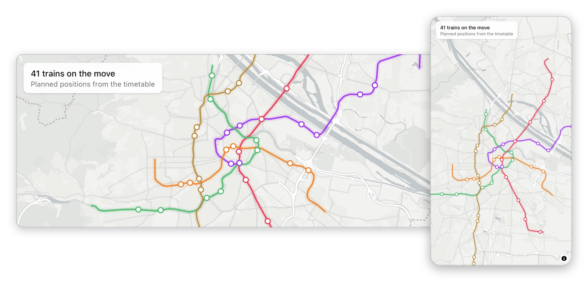

# Vienna Pulse

A map of the Vienna U-Bahn with every train moving along its line.

**Live:** https://pulse.vladdancea.com

## Architecture

| Folder | What it holds |
| --- | --- |
| `vienna-pulse-backend/` | Spring Boot 4 on Java 25, Gradle Kotlin DSL, Flyway migrations |
| `vienna-pulse-frontend/` | Angular 22 (zoneless, standalone, signals), Tailwind CSS 4, Vitest |
| `deploy/` | Production `compose.yaml` and the VPS deploy scripts |
| `.github/workflows/` | CI and deployment for both apps |

## How it works

**Feed import.** Every morning at 07:00 Vienna time the backend asks Wiener Linien for the GTFS zip with a conditional request, so an unchanged feed costs a `304`. A new feed is streamed to disk, hashed, and checked for the files the import needs. The import loads it next to the active version with Postgres `COPY` and activates it in the same transaction. A failed import leaves the previous version serving the map. A Postgres advisory lock keeps two instances from importing at once.

**Moving the trains.** Once a minute the browser asks the API which trains the timetable has running in the next ten minutes, along with their stop times. Between polls it works out every position from the clock: a train waits at a stop until its departure time, then runs at constant speed to the next stop.

**One line, two directions.** Wiener Linien publishes the track of each direction separately, and the two can sit up to about 70 m apart. Drawing both would double every line, so the map draws only one. Trains going the other way would then float next to their line, so the path of every trip is snapped onto the drawn line and both directions ride on it.

**Accessibility.** With `prefers-reduced-motion` the trains jump once per second instead of gliding. The page has a heading for screen readers and a text summary of the trains on the move.

## API

Base URL: `https://api.pulse.vladdancea.com`

| Endpoint | Returns |
| --- | --- |
| `GET /api/lines?date=2026-10-09` | GeoJSON FeatureCollection, one LineString per line and direction. `date` defaults to today in the feed's time zone. Cached for one hour, with an ETag. |
| `GET /api/shapes/{shapeId}` | GeoJSON Feature of one trip shape with the distance of every point. Cached for one day. |
| `GET /api/trains?minutes=10` | Planned trains in the window that starts now, with the stops around it. `minutes` is 1 to 30. `at` (ISO date-time) moves the start of the window, for debugging and replays. |
| `GET /actuator/health` | Health check used by the deploy. |

The `/api` endpoints answer `503` until the first feed is imported.

## Deployment

Pushes to `main` deploy on their own.

- **Frontend:** GitHub Actions tests and builds the app, then Wrangler publishes it to Cloudflare Workers static assets.
- **Backend:** GitHub Actions builds and tests the jar, then a second job without caches builds the image from that jar and pushes it to GHCR. The deploy job reaches the VPS through an SSH key that can run one script and nothing else. The script checks that the commit is on `main`, starts the new image, waits for the health check and rolls back to the previous image if it fails.
- **Network:** the backend and the database publish no ports to the internet. Public traffic arrives through a Cloudflare Tunnel, and the database sits on an internal Docker network.
- **Secrets:** they live on the server as files, never in this repository.

## Coding agents

`AGENTS.md` holds the project conventions for coding agents. `.agents/skills/` contains the vendored skills they use (Angular, Cloudflare, Gradle Kotlin DSL, Spring Boot testing), pinned in `skills-lock.json`. `.claude/skills/` holds symlinks to them, so Claude Code reads the same files.

## Data

- Timetable: Datenquelle: Stadt Wien, [data.wien.gv.at](https://data.wien.gv.at)
- Basemap: [OpenFreeMap](https://openfreemap.org) Positron style, © [OpenMapTiles](https://openmaptiles.org), data from [OpenStreetMap](https://www.openstreetmap.org/copyright)
